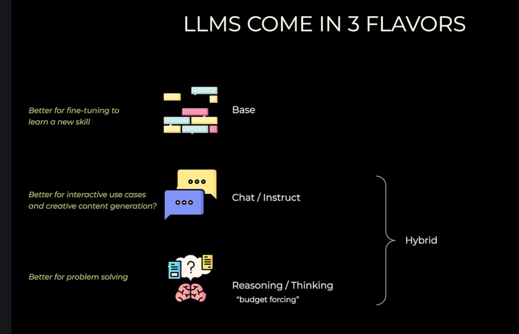

# Basics

## System prompt vs user prompt

- System prompt: This is a prompt that sets the behavior of the assistant. It is used to provide instructions to the model on how it should respond to user inputs. For example, you can use a system prompt to tell the model to be more formal, to provide detailed explanations, or to focus on a specific topic.

- User prompt: This is the prompt that the user provides to the assistant. It is the input that the user wants the assistant to respond to. For example, a user prompt could be a question, a request for information, or a command.

## Frontier Models (Closed models) vs Open Models

- Frontier Models (Closed models): These are models that are developed and maintained by specific organizations or companies. They are often proprietary and may require a subscription or payment to access.
  - ChatGPT by OpenAI
  - Claude by Anthropic
  - Gemini by Google
  - Grok by X

- Open Models: These are models that are open-source and can be accessed and modified by anyone. They are often developed by the large cooperations and the community.
  - LLaMA by Meta
  - Mistral by Mistral AI
  - Qwen by Alibaba
  - Phi by Microsoft
  - deepseek by deepseek
  - gpt-oss by openai

## Ways to use models

- Chat interface : Web-based or app-based interfaces that allow users to interact with the model in a conversational manner. Examples include ChatGPT and Claude.
- API integration : Using the model through an application programming interface (API) to integrate its capabilities into other applications or services.
- Direct Inference : Running the model directly on local hardware or cloud infrastructure and use it for specific tasks without an intermediary interface.

### API integration

#### 1. REST API : Provides access to OpenAI's models, including ChatGPT and GPT-4, for various applications.

```python
# openai rest api example
response = requests.post(
    "https://api.openai.com/v1/chat/completions",
    headers=headers,
    json=payload
)
```

```python
# google gemini rest api example
response = requests.post(
    "https://generativelanguage.googleapis.com/v1beta/openai/chat/completions",
    headers=headers,
    json=payload
)
```

#### 2. Open ai python library : A Python client library for accessing OpenAI's API, making it easier to integrate the models into Python applications.

```python
from openai import OpenAI
client = OpenAI()
response = client.chat.completions.create(
    model="gpt-4o",
    messages=[
        {"role": "system", "content": "You are a helpful assistant."},
        {"role": "user", "content": "What is the capital of France?"}
    ]
)
```

- We can use openai python library to access other models like gemni, phi, mistral, qwen, deepseek, gpt-oss etc.
- Openai python library is just a wrapper around the rest API, so we can also use rest API to access other models as well. We just need to change the endpoint an d the model name in the payload.
- OpenAI's Chat Completions API was so popular, that the other model providers created endpoints that are identical.
- They are known as the "OpenAI Compatible Endpoints".
- For example, google made one here: https://generativelanguage.googleapis.com/v1beta/openai/

```python
from openai import OpenAI
GEMINI_BASE_URL = "https://generativelanguage.googleapis.com/v1beta/openai/"
load_dotenv(override=True)
google_api_key = os.getenv("GOOGLE_API_KEY")
gemini = OpenAI(base_url=GEMINI_BASE_URL, api_key=google_api_key)
response = gemini.chat.completions.create(model="gemini-2.5-flash-lite", messages=[{"role": "user", "content": "Tell me a fun fact"}])

```


